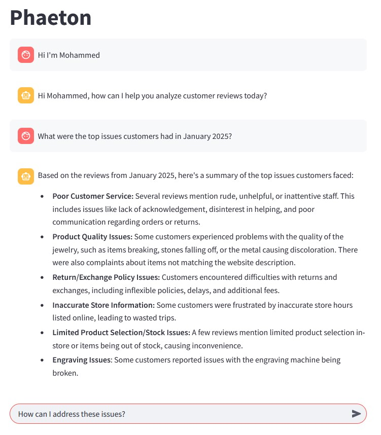

# Phaeton

This is the repository for "The Homies" team project for the Luminoso GenAI 2025 Virtual Hackathon. [Click here to try](https://thehomies.streamlit.app/)

Authors: [Mohammed Uddin](https://www.linkedin.com/in/muddint/), [Jair Ruiz](www.linkedin.com/in/jruizzz), [Kazi Sadman](www.linkedin.com/in/kazi-s)

### Table of Contents
- <a href="#about">About</a>
- <a href="#getting-started">Getting Started</a>
- <a href="#usage">Usage</a>


# About
We built a chatbot that can help customer experience analysts question review databases and receive insights and suggestions.

<!-- <div align="center"> -->
  
<!-- </div> -->

# Getting Started
Clone the project
```bash
  git clone https://github.com/JNikolo/luminoso-genai-hackathon2025.git
```
Go to project directory
```bash
  cd luminoso-genai-hackathon2025
```
Install requirements
```bash
  pip install -r requirements.txt
```
Set up API keys
- In the project directory create a file called `.env`
- Obtain a Google API key to use the Gemini model. You can obtain a Google API key from the [Google AI Studio](https://aistudio.google.com/app/apikey).
- In the `.env` file, add the following line of code:
  ```bash
  GOOGLE_API_KEY=<your code>
  ```
  where `<your code>` is replaced by the obtained API key

Run streamlit demo
```bash
  streamlit run demo.py
```

# Usage
After deploying the project, just ask questions to the UI.
To reset your message history, simply reload the page.
Some sample questions you can ask:
- What were the top issues in the month of November 2024?
- What differences in feedback are there between the stores in Boston and New York?
- Based on these responses, what actions should I take?
